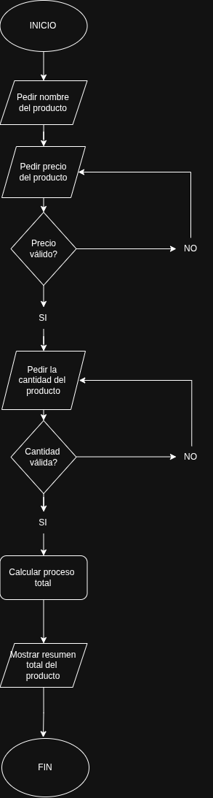

# Historia de Usuario Semana 1 - Inventario

## Descripción
Este programa le podrá permitir al usuario ingresar un producto, cuánto vale y cuanta cantidad de ese producto desea registrar. El sistema después de identificar los datos que el usuario ingresó, mostrará el nombre del producto y el monto total. 

## Diagrama de flujo:



## ¿Cómo funciona?

### Primero, se ingresa el nombre del producto.

Al iniciar el programa, la computadora en primera instancia le pedirá ingresar el nombre del producto. El cual no puede ser únicamente **Símbolos** o **Números**.

```python
nombre_producto = input("Ingrese el nombre del producto: \n")
```

El siguiente código nos explica el porqué debe haber mínimo una letra, esto es así en caso de que el producto requiera el número.
```python
 if any(letra.isalpha() for letra in nombre_producto):
        break
    else:
        print("Valor no válido. El nombre debe contener al menos una letra.")
```

Adicionalmente, usamos un "while True" para que cuando hagamos algo que tire **ERROR** en el código, este permita que solo nos pida reintentar en vez de que el programa se destruya por sí solo.

```python
while True:
   
    nombre_producto = input("Ingrese el nombre del producto: \n")

    if any(letra.isalpha() for letra in nombre_producto):
        break
    else:
        print("Valor no válido. El nombre debe contener al menos una letra.")
        continue
```

### Después de validar correctamente el nombre, insertamos el precio del producto.

Después de haber registrado correctamente el nombre del producto, debemos registrar también el precio del producto, algo a tener en cuenta es que como esta variable es un **PRECIO**, el programa solo detectará números enteros o decimales, dependiendo de cuánto sea el valor de nuestro producto.

```python                
precio_producto = float(input("Ingrese el precio del producto: \n")) 
```

Aquí usamos "Try,except" para que en caso de insertar cualquier otra cosa que el programa detecte como inválido, se muestre una pantalla de error y no se destruya de esto que acabo de mencionar se encarga el "except".

```python
    try:          
        precio_producto = float(input("Ingrese el precio del producto: \n"))
    except:   
        print("Valor no válido. Ingrese un número válido.")
```
Y tal como al pedir el nombre, usamos un "while True" para en caso de ir al "except", volver al "try" 

```python
while True:
    
    try:                  
        precio_producto = float(input("Ingrese el precio del producto: \n"))
        break
    except:
        print("Valor no válido. Ingrese un número válido.")
```
### Ahora se inserta la cantidad del producto que deseamos registrar (cuantas veces el mismo producto).

Parecido como en los pasos anteriores, ahora el programa nos pedirá registrar cuantos productos del mismo ingresamos.
```python
while True:
    try:                   
        cantidad_producto = int(input("Ingrese la cantidad del producto: \n"))
        break
    except:
        print("Valor no válido. Ingrese un número entero.")
```
### Ahora, el programa hará un cálculo entre la variable de la cantidad y el precio del producto, y mostrará un resumen con el monto total de todo lo que hemos registrado.

Después de haber insertado las 3 características que nos pide el programa, este último hará un cálculo entre cúanto registramos y su precio para mostrar la cantidad total de dinero que nos ha costado ingresar ese producto (y su cantidad) en nuestro inventario

```python
costo_total = cantidad_producto * precio_producto
```
Y para terminar, hará un resumen con ese cálculo y los datos ingresados.
```python
print("Resumen del producto:", "| Producto:", nombre_producto, "| Precio:", precio_producto, "| Cantidad:", cantidad_producto, "| Total:", costo_total)
```
### Este es un breve ejemplo del código línea por línea:
```bash
Ingrese el nombre del producto:
CocaCola2

Ingrese el precio del producto:
2.5

Ingrese la cantidad del producto:
4

Resumen del producto:
Producto: CocaCola2 | Precio: 2.5 | Cantidad: 4 | Total: 10
```
## Requisitos 

1. Necesitas "python" instalado en tu computadora, Puedes descargarlo en este link: [Python](https://www.python.org/downloads/).
2. Una consola.
3. Tener Git en tu computadora, puedes descargarlo en este link: [Git](https://git-scm.com/install/).

## ¿Cómo descargar?

1. Copia el siguiente repositorio de GitHub: [Repositorio, Historia de usuario semana 1](https://github.com/mateoriwi/Inventario-Semana-1-Historia-de-usuario.git).
2. Escribe en tu terminal y navega hasta la carpeta preferida, ahí escribirás "Git clone (https://github.com/mateoriwi/Inventario-Semana-1-Historia-de-usuario.git)
3. Espera a que termine de descargarse y listo.

## ¿Como ejecutar?

1. Abre tu terminal o consola preferida y dependiendo tu Sistema Operativo ("CTRL + Alt + T") Para Linux y ("Win + R" y cuando se abra el panel de comandos escribir "CMD")
2. Navega hasta la carpeta donde está el archivo descargado "inventario.py"
3. Ahí escribirás: "python inventario.py" para Windows o "python3 inventario.py" para Linux.

Y listo! Ya podrás ejecutar el programa correctamente!

## Tecnologías Utilizadas
- Python 
- Git
- Consola

## Autor

Mateo Hernández Mendoza, Clan: Puerta de Oro, Cohorte 5.
